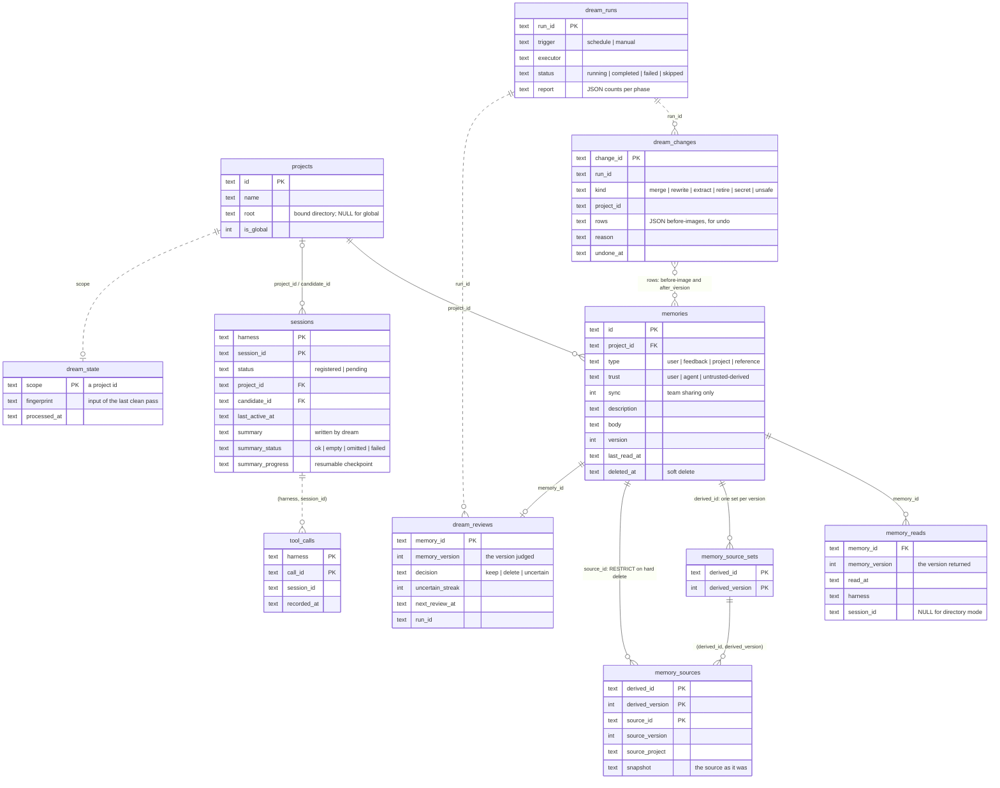

# Memory Model

## What memriver is — and is not

memriver does **not** invent a new auto-memory mechanism. File-based agent
memory — one markdown file per memory, a compact index injected at session
start, the agent reading individual files on demand — already works well
inside a single harness. Claude Code's auto memory is the reference
implementation of that model, and memriver adopts it as-is.

What no harness solves today is what happens **outside** its own walls:

1. **Cross-harness sharing.** Each tool keeps its own silo (Claude Code auto
   memory, Codex/Cursor rule files, Kiro steering). The same user working in
   two tools has two disjoint, drifting memories.
2. **Team sharing (later).** There is no path from "what I learned" to "what
   my team knows" that is reviewable and safe.

memriver's job is to take the proven single-harness model, put it behind MCP
so every harness reads and writes the *same* store, and add the discipline a
shared store needs: server-generated ids, a secrets gate, and a sync boundary.
Everything else stays deliberately boring. The interaction model (index, then
read individual entries) is Claude Code's unchanged; the storage behind it is
one SQLite database (*Storage*), not files.

## The entry

One memory has these fields -- the shape `memory_read` returns and the model
the application layer works with, not the literal `memories` table layout
(there, `source` is two columns, `source_harness` and `source_method`, and
`sync` is stored as `0`/`1`; see *Storage*):

```
id:          7kq2v9w3xa
project_id:  7kq2v9w3xg
type:        user
sync:        true
version:     1
created:     2026-08-29T10:00:00.000000Z
updated:     2026-08-29T10:00:00.000000Z
source:      {harness: claude-code, method: agent}
trust:       user
description: mise manages every runtime; check before suggesting installs
body:        All language runtimes on this machine are managed by mise, not nvm/pyenv.
```

- **type** — `user` | `feedback` | `project` | `reference`, Claude Code's
  taxonomy verbatim: who the user is; guidance on how to work; ongoing work
  and constraints; pointers to external resources. Adopted unchanged so that
  agents already trained on this taxonomy need no re-learning.
- **description** — a one-line summary, written for the reader deciding
  whether to open the entry; rendered in the index.
- **project_id** — the one project this memory belongs to; global memories
  belong to the one project row flagged global (it never has a directory --
  an unbound project has none either; the flag, not the missing directory,
  is what makes it global), read-only to agents; the human CLI can delete a
  global entry by id but never create or update one, and `memriver dream`
  writes it (*Maintenance*). The id itself carries no project.
- **version** — an optimistic-concurrency counter, starting at 1 and
  incrementing on every update or soft delete (`--hard` removes the row
  instead, so there is no new version to see). `memory_read` returns it so
  `memory_update`/`memory_delete` can require it back (*Updates, deletion,
  and history*). A row also carries `deleted_at` (set only by a soft delete)
  and `last_read_at` (set by a successful `memory_read`, and backfilled once,
  for every row where it is `NULL`, to the schema-v3 upgrade time rather than
  left `NULL` -- not a recorded read, so it adds no `memory_reads` row);
  neither is ever part of what an agent can read — the fields above are the
  whole set an agent may know.
- **sync** — per-entry boundary for future replication: `false` keeps this
  entry out of hybrid/team sync, regardless of mode. It says nothing about
  `memriver dream`, once set up: dream sends any memory whose body and
  description pass the content policy -- `sync: false` included -- to the
  configured executor's provider (*Dream*, in the README).
- **trust** — provenance of the *source material*: `user` (stated
  explicitly), `agent` (judged worth keeping while working), or
  `untrusted-derived` (distilled from external content — web pages,
  third-party code, tool output). Trust gates future promotion into shared
  storage.
- Freshness is judged by `updated`, not by type.

## Storage

Every root's data lives in one file, `<root>/memriver.db` — every project and
memory, bodies included, behind SQLite's own consistency guarantees; there is
no separate index or manifest to go stale. A project has at most one bound
directory; global has none. Nothing about a memory says where its project's
directory is — readers resolve a directory to a project, never a memory to a
location. A directory-mode surface (Cursor, Kiro, a bare `memriver` process)
resolves one directory -- `--project-dir`, defaulting to the server's own
working directory -- once, when the server starts, and every call for the
life of that process answers for it. A session-routed harness (Claude Code,
Codex) also resolves a directory once, but per session rather than per
process: at the session's own start, into its persistent row, kept for as
long as that session lives, even after its working directory changes.

The tables of `memriver.db` (schema version 3). Solid lines are foreign keys;
dotted lines are references the schema does not enforce (a run id, a session
key, a project id used as a scope name, memory ids inside a change's JSON
`rows`).



`memory_reads` is written by `memory_read`; every other `dream_*` and
`memory_source*` row, and the `summary*` columns of `sessions`, are written only
by `memriver dream` (see *Maintenance*).

## Identity

memriver generates every id: a memory's id and a project's id are 10 random
lowercase Crockford base32 characters (50 bits; no i, l, o or u), and no
caller proposes one. Short on purpose -- ids are injected into every session's
index and copied back into tool calls. A generated id that is already taken
(vanishingly unlikely at 50 bits) fails the write outright -- nothing is
retried and nothing is written; an existing memory is never overwritten. The
id is permanent -- the row's primary key, the update
handle, the future sync key -- and says nothing about where the memory
belongs: `project_id` says that. Readability comes from the description
(memories) and the name (projects), never from the id.

Because ids are generated, there is no name to collide on, and nothing stops
the same fact being written twice. The protocol tells agents to check the
index or `memory_search` before writing and to `memory_update` an existing
entry instead; there is no content-level duplicate check. `memriver doctor`
flags near-duplicate bodies.

## Recall

Recall follows the index-and-read pattern, unchanged from single-harness
practice:

- `memory_index` renders one line per live entry (id + description,
  falling back to the body's first line for entries without one) under a
  line budget, with an explicit truncation notice. The harness injects it at
  session start; the LLM does the semantic matching. The index lists the
  current project's entries first, then global's (tagged `global`), in one
  line budget; `memory_search` runs one search per project with one total
  `limit`, project hits first.
- `memory_read` fetches one entry by id; an id that is absent, outside the
  session's readable projects (the current project and global), or soft-deleted
  is "no such entry" — the three look identical to an agent — while a row that
  exists but cannot be read (a value memriver could not have written) is
  reported as unreadable.
- `memory_search` exists as a tool contract, but the local engine is a plain
  case-insensitive substring scan over the project's rows, computed in Python
  rather than in SQL. At local scale (hundreds of entries) an LLM scanning the
  index outperforms any keyword engine, so the local layer ships no search
  infrastructure. When hybrid mode adds semantic retrieval, the engine
  upgrades behind the same contract — agents never notice.

## Updates, deletion, and history

- Update = rewrite the row's `body`/`description` in place inside one
  transaction, bump `version` and `updated`. `memory_update` requires the
  `expected_version` that `memory_read` returned; a memory changed since is
  refused with nothing written, never silently overwritten.
- Delete through MCP is always a soft delete: `deleted_at` is set and
  `version` bumps, but the row stays. `memory_delete` confirms the delete
  (`{deleted: id}`) like any other tool call, but nothing anywhere -- that
  result, an error, or an index entry -- ever reveals that the delete was
  soft or that the row remains: a later `memory_read`/`memory_search`/
  `memory_index` treats that id exactly as if it had never existed.
  `memory_delete` also requires `expected_version`.
- `memriver delete --hard` (the human CLI, *Management views*) removes the
  row itself, including one already soft-deleted. A memory soft-deleted by
  `memory_delete` or `memriver delete` is recoverable only by an operator —
  there is no undelete command, so recovery means clearing `deleted_at` on
  that row directly in `memriver.db` (`memriver show ID --deleted` finds it
  first); `memory_write` cannot do this, since it always assigns a new id
  rather than reviving an old one. A memory `memriver dream` soft-deleted (a
  `secret`, `unsafe` or `retire` change) is the one exception:
  `memriver dream undo CHANGE_ID` restores it, while none of that change
  group's rows have changed since (*Maintenance*). There is no MCP path to a
  hard delete, and a hard delete of a memory that a derived entry cites as a
  source is refused (*Maintenance*).
- The local store keeps **no history of old bodies** for an ordinary edit:
  `version` guards against a lost concurrent update, it is not a log.
  `memriver dream`'s own changes are the exception: each keeps a before-image
  of the row it changed, and a merge/rewrite/extract also keeps a snapshot of
  every source it drew from (`memory_sources`) -- what lets
  `memriver dream undo CHANGE_ID` put a change group back (*Maintenance*).
  Full history and conflict-free replication for everything else remain the
  sync layer's job, where object-store native versioning provides them
  without any local machinery.

## Management views

`memriver list` / `show` / `search` / `export` (README has the exact CLI
grammar) are read-only views for a person, not the MCP surface agents use:
they see every project including global, `show --deleted` can surface a
soft-deleted row and its `deleted_at`, and none of them go through a
`ReadWriteSet` the way a session does. `memriver delete` is the one
per-memory write path outside MCP (project `init`/`adopt`/`unbind`, `install`
and `uninstall --purge-data` write too, but to the project rows or the
whole store, never to one memory's content); `delete` always resolves the
current directory the command itself runs in, the way directory mode does
(*Storage*) -- not a session-routed agent's stored project, which
`memory_delete` acts on instead -- while a global entry is deleted by id from anywhere,
the one global write the human CLI has.

## Maintenance

`updated` is the time of the last change, nothing more: rewriting an entry
records that it was rewritten, not that anyone confirmed it is still true.
Agents never write global: MCP refuses every write to it, whichever project
a session is registered to. Two paths outside MCP do. `memriver delete`
deletes a global entry by id (a management delete of the human CLI), and
`memriver dream` -- an offline run started by a schedule or by hand -- keeps
the store in shape without a review step: it soft-deletes memories that now
match a secret rule, merges duplicates and rewrites contradicted entries
within a project, extracts facts that hold beyond one project into global,
soft-deletes entries that are instructions addressed to an agent, and retires
memories unused past a TTL that every recorded read lengthens, after asking a
model for a reason to. It writes through the same versioned rows, with
`source.method = dream`, a trust no higher than its least trusted source and
`sync` on only when every source had it on. Every change it makes is one
change group that `memriver dream undo` reverses while its rows are
unchanged; `memriver dream report` lists them. A derived entry records the
memories and versions it came from (`memory_sources`, with a snapshot of each
source), so a source cannot be hard-deleted while an entry cites it.
Maintenance never counts as use: no dream read moves `last_read_at`.
`memriver doctor --stale-days N` still lists memories not updated in N days
as a starting point for a manual review.

## The write gate

Every write passes a deterministic, LLM-free gate before touching disk:
size limits, then a vendored secrets ruleset (gitleaks rules plus a small
floor of provider rules with known upstream gaps). Rejections name the rule,
never echo the secret. The gate is a pure function of the content, so
local-only mode needs no network and no model.

## How harnesses learn the protocol

External harnesses know nothing about this taxonomy up front, and never need
to. The protocol reaches their agents through three layers:

1. **MCP tool schemas (zero-install, universal).** `memory_write` declares
   `type` as a schema enum, and the tool descriptions carry one-line
   semantics for each type plus the note that memriver assigns every id.
   Every MCP client feeds tool descriptions to its model, so any harness
   that can connect the server has already been taught — this is why MCP
   is the integration surface in the first place.
2. **Refusal as correction (backstop).** Two kinds of refusal, from two
   places. Arguments outside a tool's schema -- an unknown `type`, a
   parameter the tool does not take -- are rejected by the MCP layer before
   the tool runs, and the schema itself lists the valid values. A write the
   tool refuses -- secret-shaped content, no writable project, a read-only
   global memory -- comes back as a fixed, path-free message that says what
   to do next. Either way the agent self-corrects within the same turn; the
   server never guesses.
3. **Installed protocol instructions (richer guidance).** Tool descriptions
   cannot carry behavioral guidance — when to write a memory, what not to
   store, check the index before writing. `memriver install` writes it per
   harness; what each one gets is the install table in the README. The
   injection points differ per harness; the text is one source, maintained in
   the server.

Layers 1–2 alone make an MCP-only harness work correctly in directory mode
(Cursor, Kiro, or any client connected with no `--harness`); layer 3
upgrades "works" to "works well". A Claude Code/Codex session additionally
needs its hooks (four for Codex, five for Claude Code): without them a session's row is never registered, so
MCP alone leaves it reading global memory only, with no project of its own
to write to. The taxonomy's four words fitting in a tool description is
itself part of why it was adopted.

## Modes and sync (forward-looking)

- **Local-only** — everything above; one local SQLite file, no LLM, no network
  for the store, its tools and its CLI. `memriver dream`'s secret re-scan
  needs neither, either; its summarize/consolidate/retire phases are the
  exception, and send policy-passing memory and session text to whichever
  harness `memriver dream init` configures as executor (README, *Dream*) --
  nothing is sent until that setup is done.
- **Hybrid** — entries with `sync: true` replicate to user-owned object
  storage; versioning and multi-device semantics live there.
- **Team** — shared knowledge is produced by a distillation pipeline with
  human review, never by raw entry replication; `trust` and `sync` are the
  gates on that path.

Only local-only exists today; the fields above are the extent of the
provisioning for the later modes.

## Non-goals

- A new memory taxonomy, storage format, or recall strategy.
- Local search infrastructure beyond a plain substring scan (full-text
  search, tokenizers, embeddings).
- Local version history, immutable entry chains, or supersede protocols.
- Restoring a soft-deleted memory through MCP or the human CLI (an operator
  can, by hand against `memriver.db`).
- Agent-controlled naming or layout.
