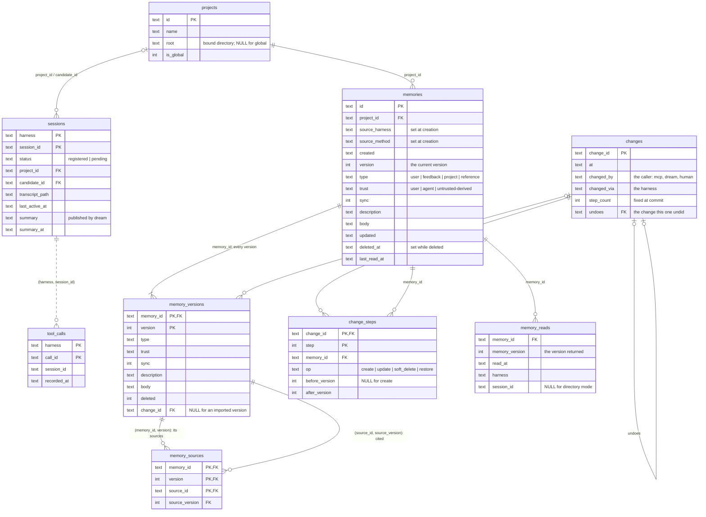

# Memory Model

## What memriver is — and is not

memriver does **not** invent a new auto-memory mechanism. File-based agent
memory — one markdown file per memory, a compact index injected at session
start, the agent reading individual files on demand — already works well
inside a single harness. Claude Code's auto memory is the reference
implementation of that model, and memriver adopts it as-is.

What no harness solves today is what happens **outside** its own walls:

1. **Cross-harness sharing.** Each tool keeps its own silo (Claude Code auto
   memory, Codex/Cursor rule files, Kiro steering). The same user working in
   two tools has two disjoint, drifting memories.
2. **Team sharing (later).** There is no path from "what I learned" to "what
   my team knows" that is reviewable and safe.

memriver's job is to take the proven single-harness model, put it behind MCP
so every harness reads and writes the *same* store, and add the discipline a
shared store needs: server-generated ids, a secrets gate, and a sync boundary.
Everything else stays deliberately boring. The interaction model (index, then
read individual entries) is Claude Code's unchanged; the storage behind it is
one SQLite database (*Storage*), not files.

## The entry

One memory has these fields -- the shape `memory_read` returns and the model
the application layer works with, not the literal `memories` table layout
(there, `source` is two columns, `source_harness` and `source_method`, and
`sync` is stored as `0`/`1`; see *Storage*):

```
id:          7kq2v9w3xa
project_id:  7kq2v9w3xg
type:        user
sync:        true
version:     1
created:     2026-08-29T10:00:00.000000Z
updated:     2026-08-29T10:00:00.000000Z
source:      {harness: claude-code, method: agent}
trust:       user
description: mise manages every runtime; check before suggesting installs
body:        All language runtimes on this machine are managed by mise, not nvm/pyenv.
```

- **type** — `user` | `feedback` | `project` | `reference`, Claude Code's
  taxonomy verbatim: who the user is; guidance on how to work; ongoing work
  and constraints; pointers to external resources. Adopted unchanged so that
  agents already trained on this taxonomy need no re-learning.
- **description** — a one-line summary, written for the reader deciding
  whether to open the entry; rendered in the index.
- **project_id** — the one project this memory belongs to; global memories
  belong to the one project row flagged global (it never has a directory --
  an unbound project has none either; the flag, not the missing directory,
  is what makes it global), read-only to agents; `memriver dream` and a
  person's management commands write it (*Maintenance*). The id itself
  carries no project.
- **version** — the number of the memory's current version, starting at 1;
  every change of its description, body, sources or deleted state adds one,
  and every earlier version is kept (*Updates, deletion, and history*).
  `memory_read` returns it so `memory_update`/`memory_delete` can require it
  back. A row also carries `deleted_at` (set while the current version is
  deleted) and `last_read_at` (set by a successful `memory_read`); neither,
  nor any older version, is ever part of what an agent can read — the fields
  above are the whole set an agent may know.
- **sync** — per-entry boundary for future replication: `false` keeps this
  entry out of hybrid/team sync, regardless of mode. It says nothing about
  `memriver dream`, once set up: dream sends any memory whose text passes the
  content policy -- `sync: false` included -- to the configured executor's
  provider (README, *Dream*). Creating or updating an entry with sources sets
  `sync: true` only when its previous state and every cited version are;
  restoring a version (directly, or as an undo) instead puts back that
  version's own recorded `sync`, which can raise it again (*Updates, deletion,
  and history*).
- **trust** — provenance of the *source material*: `user` (stated
  explicitly), `agent` (judged worth keeping while working), or
  `untrusted-derived` (distilled from external content — web pages,
  third-party code, tool output). Trust gates future promotion into shared
  storage. Creating or updating an entry with sources (*Storage*) gives it the
  lowest trust of its previous state and every cited version; restoring a
  version (directly, or as an undo) instead puts back that version's own
  recorded trust, which can raise it again.
- Freshness is judged by `updated`, not by type.

## Storage

Every root's data lives in one file, `<root>/memriver.db` — every project and
memory, bodies included, behind SQLite's own consistency guarantees; there is
no separate index or manifest to go stale. A project has at most one bound
directory; global has none. Nothing about a memory says where its project's
directory is — readers resolve a directory to a project, never a memory to a
location. A directory-mode surface (Cursor, Kiro, a bare `memriver` process)
resolves one directory -- `--project-dir`, defaulting to the server's own
working directory -- once, when the server starts, and every call for the
life of that process answers for it. A session-routed harness (Claude Code,
Codex) also resolves a directory once, but per session rather than per
process: at the session's own start, into its persistent row, kept for as
long as that session lives, even after its working directory changes.

The tables of `memriver.db` (schema version 4). Solid lines are foreign keys;
the dotted line is a reference the schema does not enforce (a tool call's
session).


```mermaid
erDiagram
    projects ||--o{ memories : "project_id"
    projects |o--o{ sessions : "project_id / candidate_id"
    sessions ||..o{ tool_calls : "(harness, session_id)"
    memories ||--|{ memory_versions : "memory_id: every version"
    memory_versions ||--o{ memory_sources : "(memory_id, version): its sources"
    memory_versions ||--o{ memory_sources : "(source_id, source_version): cited"
    changes |o--o{ memory_versions : "change_id: NULL for an imported version"
    changes ||--o{ change_steps : "change_id"
    memories ||--o{ change_steps : "memory_id"
    changes |o--o| changes : "undoes"
    memories ||--o{ memory_reads : "memory_id"

    projects {
        text id PK
        text name
        text root "bound directory; NULL for global"
        int is_global
    }
    memories {
        text id PK
        text project_id FK
        text source_harness "set at creation"
        text source_method "set at creation"
        text created
        int version "the current version"
        text type "user | feedback | project | reference"
        text trust "user | agent | untrusted-derived"
        int sync
        text description
        text body
        text updated
        text deleted_at "set while deleted"
        text last_read_at
    }
    memory_versions {
        text memory_id PK, FK
        int version PK
        text type
        text trust
        int sync
        text description
        text body
        int deleted
        text change_id FK "NULL for an imported version"
    }
    memory_sources {
        text memory_id PK, FK
        int version PK, FK
        text source_id PK, FK
        int source_version FK
    }
    changes {
        text change_id PK
        text at
        text changed_by "the caller: mcp, dream, human"
        text changed_via "the harness"
        int step_count "fixed at commit"
        text undoes FK "the change this one undid"
    }
    change_steps {
        text change_id PK, FK
        int step PK
        text memory_id FK
        text op "create | update | soft_delete | restore"
        int before_version "NULL for create"
        int after_version
    }
    memory_reads {
        text memory_id FK
        int memory_version "the version returned"
        text read_at
        text harness
        text session_id "NULL for directory mode"
    }
    sessions {
        text harness PK
        text session_id PK
        text status "registered | pending"
        text project_id FK
        text candidate_id FK
        text transcript_path
        text last_active_at
        text summary "published by dream"
        text summary_at
    }
    tool_calls {
        text harness PK
        text call_id PK
        text session_id
        text recorded_at
    }
```

`memories` holds each memory's current state, which always equals its
`memory_versions` row at `version`; agent reads, the index and search read
`memories` alone. `memory_sources` lists, for each version, the versions of
other memories it was built from (`memriver dream`'s merges, rewrites and
extractions); a cited version cannot be deleted while a version citing it
exists, except by a hard delete that takes both. Every version except an
imported one belongs to exactly one `changes` row, and a change has one
`change_steps` row per memory it touched. Changes are kept for good and
`step_count` stays as committed, so a change a hard delete made incomplete
has fewer steps than `step_count`. `memory_reads` is written by
`memory_read`. `memriver dream`'s own records live in a separate file
(`dream/dream.db`), not here.

## Identity

memriver generates every id: a memory's id and a project's id are 10 random
lowercase Crockford base32 characters (50 bits; no i, l, o or u), and no
caller proposes one. Short on purpose -- ids are injected into every session's
index and copied back into tool calls. A generated id that is already taken
(vanishingly unlikely at 50 bits) fails the write outright -- nothing is
retried and nothing is written; an existing memory is never overwritten. The
id is permanent -- the row's primary key, the update
handle, the future sync key -- and says nothing about where the memory
belongs: `project_id` says that. Readability comes from the description
(memories) and the name (projects), never from the id.

Because ids are generated, there is no name to collide on, and nothing stops
the same fact being written twice. The protocol tells agents to check the
index or `memory_search` before writing and to `memory_update` an existing
entry instead; there is no content-level duplicate check. `memriver doctor`
flags near-duplicate bodies.

## Recall

Recall follows the index-and-read pattern, unchanged from single-harness
practice:

- `memory_index` renders one line per live entry (id + description,
  falling back to the body's first line for entries without one) under a
  line budget, with an explicit truncation notice. The harness injects it at
  session start; the LLM does the semantic matching. The index lists the
  current project's entries first, then global's (tagged `global`), in one
  line budget; `memory_search` runs one search per project with one total
  `limit`, project hits first.
- `memory_read` fetches one entry by id; an id that is absent, outside the
  session's readable projects (the current project and global), or soft-deleted
  is "no such entry" — the three look identical to an agent — while a row that
  exists but cannot be read (a value memriver could not have written) is
  reported as unreadable.
- `memory_search` exists as a tool contract, but the local engine is a plain
  keyword scan over the project's rows (any keyword matches, entries matching
  more keywords first; NFKC and case-folded), computed in Python rather than
  in SQL. At local scale (hundreds of entries) an LLM scanning the index
  outperforms any keyword engine, so the local layer ships no search
  infrastructure. When hybrid mode adds semantic retrieval, the engine
  upgrades behind the same contract — agents never notice.

## Updates, deletion, and history

- Every change of a memory's description, body, sources or deleted state
  writes a new version, in one transaction with its change record, and moves
  the row's `version` and `updated`; old versions are kept for good, and a
  write that changes nothing writes nothing. `memory_update` requires the
  `expected_version` that `memory_read` returned; a memory changed since is
  refused with nothing written, never silently overwritten.
- Delete through MCP is always a soft delete: a new version marked deleted,
  `deleted_at` set, the row and its history kept. `memory_delete` confirms
  the delete (`{deleted: id}`) like any other tool call, but nothing
  anywhere -- that result, an error, or an index entry -- ever reveals that
  the delete was soft or that the row remains: a later
  `memory_read`/`memory_search`/`memory_index` treats that id exactly as if
  it had never existed. `memory_delete` also requires `expected_version`.
- Every write that creates a version is one change: an id, a time, who made
  it (`mcp`, `dream` or `human`, supplied by the entry point, never by a
  model) and through which harness, and one step per memory it touched with
  its versions before and after. A person reads the history (`memriver
  history`), makes an older version current again (`memriver restore`, which
  also undeletes) and reverses a whole change while none of the memories it
  touched has changed since (`memriver undo`); agents see none of it, and MCP
  has no path to any of it.
- `memriver delete --hard` (the human CLI, *Management views*) is the only way
  versions leave the store, and it is not a change: it removes a memory's rows
  outright -- its whole history, sources and reads -- together with every
  memory citing any version of it, after showing that set and checking it did
  not change, and with no content-policy check of its own. Existing change
  records stay, without the deleted memories' steps, but a hard delete adds no
  new one. There is no MCP path to a hard delete.
- History stays local; replicating it is the sync layer's job.

## Management views

`memriver list` / `show` / `search` / `export` (README has the exact CLI
grammar) are read-only views for a person, not the MCP surface agents use:
they see every project including global, `show --deleted` can surface a
soft-deleted row and its `deleted_at`, and none of them go through a
`ReadWriteSet` the way a session does. `memriver history` reads every version
of one memory. A soft `delete`, `restore` and `undo` are the per-memory write
paths outside MCP besides `memriver dream` (project `init`/`adopt`/`unbind`,
`install` and `uninstall --purge-data` write too, but to the project rows or
the whole store, never to one memory's content), each recorded as a change
made by `human`; a hard delete is the exception -- it makes no change of its
own (*Updates, deletion, and history*). `delete` of an ordinary memory resolves
the current directory the command itself runs in, the way directory mode does
(*Storage*) -- not a session-routed agent's stored project, which
`memory_delete` acts on instead; a global memory is deleted by id from
anywhere.

## Maintenance

`updated` is the time of the last change, nothing more: rewriting an entry
records that it was rewritten, not that anyone confirmed it is still true.
Agents never write global: MCP refuses every write to it, whichever project a
session is registered to. `memriver dream` -- an offline run started by a
schedule or by hand (README, *Dream*) -- keeps the store in shape without a
review step, through the same write path and change log as everything else,
as `dream`: it merges duplicates, rewrites outdated entries and soft-deletes
superseded ones within one project (or within global); it extracts
principles backed by memories of at least two projects into global, citing
them, and re-checks a global entry when a source it cites has changed; and it
soft-deletes memories unused past a TTL that every recorded read lengthens,
after asking a model. It never hard-deletes: content-policy hits in any
stored version, contradictions and instruction-like entries are listed for a
person to act on. Each of its changes can be undone with `memriver undo`
while the memories it touched are unchanged. Maintenance never counts as
use: no dream read moves `last_read_at` or records a read. `memriver doctor
--stale-days N` still lists memories not updated in N days as a starting
point for a manual review.

## The write gate

Every write passes a deterministic, LLM-free gate before touching disk:
size limits, then a vendored secrets ruleset (gitleaks rules plus a small
floor of provider rules with known upstream gaps). Rejections name the rule,
never echo the secret. The gate is a pure function of the content, so
local-only mode needs no network and no model. It applies to every write that
creates a version -- a create, update or soft delete, `restore` and `undo`
included -- so a soft delete of a memory whose stored text now fails a rule is
refused too. A hard delete runs no check of its own: it deletes rows outright
rather than writing a new state, which is how a secret already in the store
is removed once a soft delete would be refused. `memriver doctor` and the
next dream run list any stored version that fails today's rules.

When a `[classifier]` table configures the content classifier, a second step follows
the content policy for every write that carries
new text -- a create, or an update with a new description or body: the new text alone
(description and body, nothing else) goes to the configured classifier before the
write transaction opens, never inside it, so a slow answer never holds the store's
write lock. Which writes it sees is switched by the caller (`changed_by`): agent
writes (`mcp`) and dream's (`dream`) each have a switch, and a person's (`human`) are
never sent. A block, or a classifier that cannot decide, refuses the write and nothing
is written. Unlike the content policy this step is not LLM-free and, with a hosted
executor, not local; without the table memriver calls no classifier at all.

## How harnesses learn the protocol

External harnesses know nothing about this taxonomy up front, and never need
to. The protocol reaches their agents through three layers:

1. **MCP tool schemas (zero-install, universal).** `memory_write` declares
   `type` as a schema enum, and the tool descriptions carry one-line
   semantics for each type plus the note that memriver assigns every id.
   Every MCP client feeds tool descriptions to its model, so any harness
   that can connect the server has already been taught — this is why MCP
   is the integration surface in the first place.
2. **Refusal as correction (backstop).** Two kinds of refusal, from two
   places. Arguments outside a tool's schema -- an unknown `type`, a
   parameter the tool does not take -- are rejected by the MCP layer before
   the tool runs, and the schema itself lists the valid values. A write the
   tool refuses -- secret-shaped content, no writable project, a read-only
   global memory -- comes back as a fixed, path-free message that says what
   to do next. Either way the agent self-corrects within the same turn; the
   server never guesses.
3. **Installed protocol instructions (richer guidance).** Tool descriptions
   cannot carry behavioral guidance — when to write a memory, what not to
   store, check the index before writing. `memriver install` writes it per
   harness; what each one gets is the install table in the README. The
   injection points differ per harness; the text is one source, maintained in
   the server.

Layers 1–2 alone make an MCP-only harness work correctly in directory mode
(Cursor, Kiro, or any client connected with no `--harness`); layer 3
upgrades "works" to "works well". A Claude Code/Codex session additionally
needs its hooks (four for Codex, five for Claude Code): without them a session's row is never registered, so
MCP alone leaves it reading global memory only, with no project of its own
to write to. The taxonomy's four words fitting in a tool description is
itself part of why it was adopted.

## Modes and sync (forward-looking)

- **Local-only** — everything above; one local SQLite file, no LLM, no network
  for the store, its tools and its CLI. `memriver dream`'s policy scan needs
  neither; its model steps are the exception, and send policy-passing memory
  and session text to whichever harness `memriver dream init` configures as
  executor (README, *Dream*) -- nothing is sent until that setup is done.
- **Hybrid** — entries with `sync: true` replicate to user-owned object
  storage; versioning and multi-device semantics live there.
- **Team** — shared knowledge is produced by a distillation pipeline with
  human review, never by raw entry replication; `trust` and `sync` are the
  gates on that path.

Only local-only exists today; the fields above are the extent of the
provisioning for the later modes.

## Non-goals

- A new memory taxonomy, storage format, or recall strategy.
- Local search infrastructure beyond a plain keyword scan (full-text
  search, tokenizers, embeddings).
- History visible to agents, or supersede protocols agents must follow.
- Restoring a soft-deleted memory through MCP (a person can, with `memriver
  restore`).
- Agent-controlled naming or layout.
